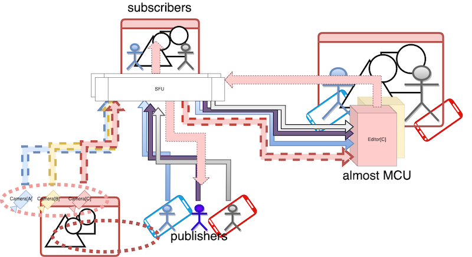
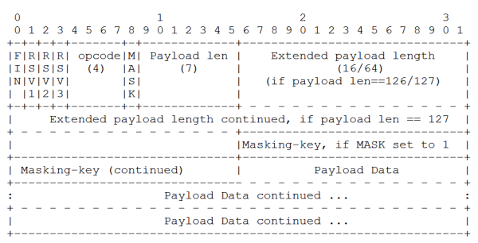
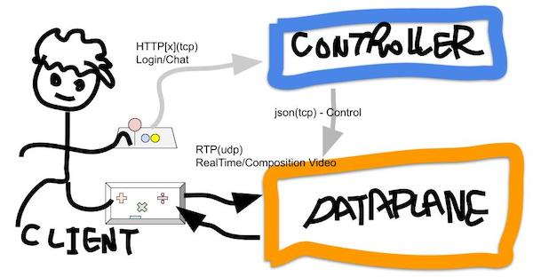
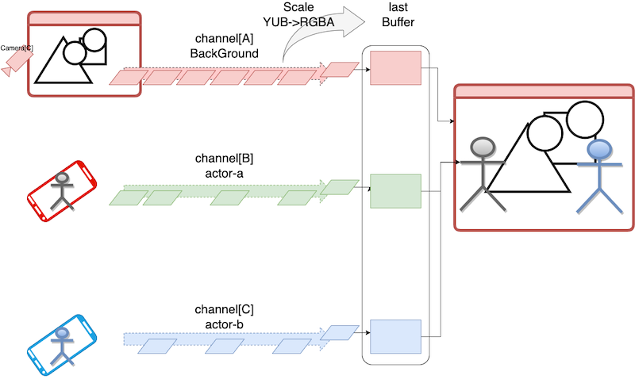
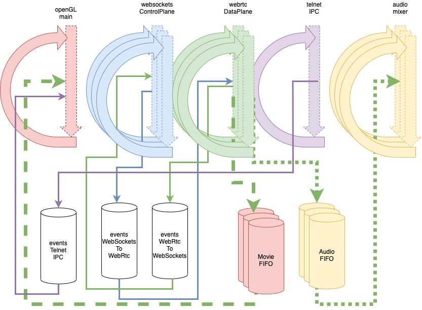
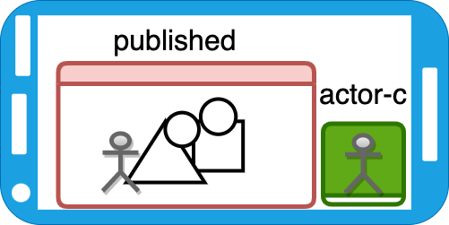

# bres

**bres** , sample Implementaion of Virtual MCU.

## Virtual MCU

+ Receive multi-channel video(VP8),audio(opus) data from SFU.
+ Chroma key compositing(edits) based on attributes
  + attributes(scale, position[x,y], chromakey-threshould)
+ Sends compositted data to SFU as separated send-only channels.
+ works in osx 10.15 later, can run by connectiong to SFU.
  + （TODO)ubuntu + GPU / EGL + HeadLess(with compile/switch)




+ available SFU
  + [sora](https://sora.shiguredo.jp/)

## Characteristic design


## download

```
git clone git@github.com:xflagstudio/bres.git
```
## compile/link

```
mkdir -p ./_build
cd ./_build
cmake ..
make -j
make
```

## dependencies

```
brew install glew
brew install glfw
brew install glm
```

### libwebsockets



> License / MIT

```
git clone https://libwebsockets.org/repo/libwebsockets
mkdir -p ./_build
cd ./_build
cmake .. -DCMAKE_MAKE_PROGRAM=/usr/bin/make -DLWS_WITH_MINIMAL_EXAMPLES=1
make -j
sudo make install
```

+ if needed linking Specific Version openssl

```
cmake .. -DCMAKE_MAKE_PROGRAM=/usr/bin/make -DLWS_OPENSSL_INCLUDE_DIRS=/usr/local/opt/openssl@1.1/include '-DLWS_OPENSSL_LIBRARIES=/usr/local/opt/openssl/lib/libssl.dylib;/usr/local/opt/openssl/lib/libcrypto.dylib' -DLWS_WITH_MINIMAL_EXAMPLES=1
```

+ cmake logs when Specific Version openssl

```
Compiling with SSL support
-- Found OpenSSL: /usr/local/lib/libcrypto.dylib (found version "1.1.1l")  
OpenSSL include dir: /usr/local/include
OpenSSL libraries: /usr/local/lib/libssl.dylib;/usr/local/lib/libcrypto.dylib
```

### libwebrtc

[libwebrtc.a , for each environment](https://github.com/crow-misia/libwebrtc-bin)

> License /Apache License 2.0

+ Web OSS(Real-Time Communication) project by google.
+ Not include Interface for signaling(Control Plane)
+ Library for develop RTP Application
  + for browser, mobile-platform, IoT devices
+ High Level Abstruction of [S]RTP/[S]RTCP/STUN/TURN/ICE protocols
  (chrome's webRTC implementation)
  + like CreatePeerConnectin()
  + Bidirectional Communnication

> setup to ${HOMEDIR}/setup/libwebrtc-bin


### stb

```
git clone https://github.com/nothings/stb.git
cd stb
cp -a stb* /usr/local/include/
```

## Processing Sequence

|function|group|protocol|desc|delay|
|---|---|---|---|---|
|SFU signaling|Control Plane/Request|websocket(ssl)|json|> 100 ms|
|--|Control Plane/Response|--|sdp string|--|
|setup libwebrtc<br>PeerConnection|Control Plane -> DataPlane|function call|sdp|xx ns|
|webRTC|DataPlane||in libwebrtc|need low latency|





### OpenGL - rendering

+ convert video : YUV -> RGBA
+ update Texture buffer in best effort
  + glTexSubImage2D
+ alpha blending on GPU

> best effort, on Channels with large received-delay, use previous video buffer for composition processing.




## Context/openGL thread

+ on same threads
  + creates textures
  + alpha blending of textures
+ for safety
  + separate libwebsockets entry-loop for each channel
    + deacklok by SFU(like apache prefork)
+ do'nt Shared Instance,instanciate for each channel
  + webrtc::PeerConnectionInterface
  + webrtc::PeerConnectionFactoryInterface



## environment

```
export SIGNALING_SERVER=127.0.0.1
export WEBRTC_TOKEN=<webrtc - token password>
```

## telnet 127.0.0.1 50002

### add receive channel

```
{"type":"recieve/channel/add","signaling_server": "<host>", "channel_id":"<channel>", "channel_token":"<token>",  "channel_multiple_stream": "on"}
```

### update attributes on receive channel

```
{"type":"recieve/channel/property","channel_id":"<channel>","is_draw": "1", "pos_x":"320.0", "pos_y":"0.0",  "scale": "0.5", "chromakey": "0.0"}
```

## sample application image




## compile/link(ubuntu20.04)

```
apt install cmake
apt install git
apt install libglu1-mesa-dev mesa-common-dev
apt install libglew-dev
apt install libglfw3-dev
apt install nlohmann-json3-dev
apt install libevent-dev
apt install libsdl2-dev
apt install libsdl1.2-dev
apt install libglm-dev
apt install libc++-10-dev
apt install clang
apt install libc++abi-dev
```

> same version of clang that comile/link libwebrtc.a

```
wget https://apt.llvm.org/llvm.sh
chmod +x llvm.sh
sudo ./llvm.sh <version number>
```

```
export CXX=/usr/bin/clang-14
export CC=/usr/bin/clang-14
export PATH="/usr/lib/llvm-14/bin:$PATH"
```

## output blackmagic device/ubuntu20.04

+ DeckLinkDuo
  + Blackmagic_Desktop_Video_Linux_12.2.tar
  + Blackmagic_DeckLink_SDK_12.2.zip

```
cd ./Blackmagic*
sudo apt install libgl1 libgl1-mesa-glx dkms
cd ./deb/x86*
sudo dpkg -i desktopvideo_*.deb
```

```
mkdir -p ./_build
cd ./_build
cmake .. -D__BLACKMAGIC_OUTPUT__
make -j
make
```


## related work

+ compile/link available on ubuntu(headless,GLE)
+ SFU/MCU
